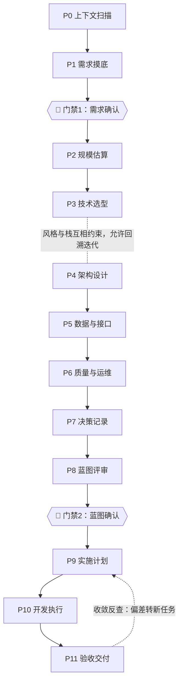

# 全项目架构设计（Architecture Design）

从一句想法到可交付的完整项目。本技能的目标不是"画出漂亮的架构图"，而是**让接下来的开发一次就做对**：需求不遗漏、设计可追溯、开发有验收、交付有证据。

## 三个核心机制（为什么这样做）

项目返工的头号原因是**需求遗漏**和**设计与实现脱节**。本技能用三个机制应对，而不是靠自觉：

1. **需求可测**：每条需求写成"用户故事 + WHEN…THE SYSTEM SHALL…"验收标准并编号（REQ-001）。设计、任务、验收全部围绕编号展开，不允许出现"凭感觉做了但没人要"或"要了但没人做"的功能。
2. **双向追踪**：蓝图评审时过"需求追踪矩阵"——每条 REQ 必须有设计覆盖；实施计划中每个任务反向标注"本任务实现哪些 REQ"。
3. **两道门禁**：需求未确认不设计（门禁 1），蓝图未确认不开发（门禁 2）。走到门禁就停下等用户确认，不要自作主张跳过。门禁支持**快速确认**：用户明确预授权（"按你的推荐走，别反复问我"）时，门禁降级为"把采用的假设逐条写进文档，继续推进，到下一个门禁或里程碑再对账"——预授权也是授权，但假设必须落在纸面上。

## 先分诊：用多重的流程做这件事？

| 档位 | 适用场景 | 流程 | 产出 |
|---|---|---|---|
| **迷你** | 周末项目、小工具、单人自用 | Phase 0→1→4→9 压缩进行，需求与方案合并为一次确认 | 单文档 docs/architecture/mini-blueprint.md（按 assets/templates/mini-blueprint.md；REQ 编号与验收标准不省略） |
| **标准**（默认） | 常规新项目、中型改造 | 完整 12 阶段 | 四份文档 |
| **完整** | 多人团队、长周期、高出错代价 | 完整 12 阶段，另加模块级设计评审、ADR 全量落档 | 四份文档 + 模块级设计文档 |

拿不准时选标准档；用户说"简化点/别搞那么重"就降一档。反过来，改 bug、调样式、加小字段这类改动**不需要本技能的全流程**——直接做，别为改一行代码建 docs/architecture/。

## 工作流总览



各阶段按需读对应参考文件（references/），按模板产出文档（assets/templates/）。不确定该读哪个时，按下表：

| 阶段 | 读 | 产出 |
|---|---|---|
| Phase 1 需求摸底 | references/requirements.md | docs/architecture/requirements.md |
| Phase 2 规模估算 | references/estimation.md | 蓝图"规模估算"章节 |
| Phase 3 技术选型 | references/tech-stack.md | 蓝图"技术栈"章节（+可选 ADR） |
| Phase 4 架构设计 | references/patterns.md、references/diagram.md | 蓝图"架构"章节 + C4 图 |
| Phase 5 数据与接口 | references/data-and-api.md | 蓝图"数据/接口"章节 |
| Phase 6 质量与运维 | references/quality-attributes.md、testing-quality.md、deployment.md | 蓝图"质量/部署"章节 |
| Phase 7 决策记录 | references/adr.md | docs/architecture/decisions/ADR-*.md |
| Phase 8 蓝图评审 | —（汇总） | docs/architecture/blueprint.md |
| Phase 9 实施计划 | references/project-structure.md | docs/architecture/plan.md + 项目骨架 |
| Phase 10 开发执行 | references/code-review.md（评审者清单） | 代码 + 更新后的 plan.md |
| Phase 11 验收交付 | —（对照 requirements.md） | 交付说明 |

---

## Phase 0：上下文扫描

先弄清身在何处，再谈怎么设计。

1. 判断绿地（从零开始）还是存量（已有代码/系统）。
2. **存量项目**：先读 README、目录结构、依赖清单（package.json / requirements.txt / pom.xml 等）、已有 docs。识别三件事：技术栈、既有约定（目录/命名/风格）、已有架构决策（若存在 docs/architecture/ 或 ADR，先读完）。同时把可发现的**工程标准**提炼成清单（编码风格、测试约定、目录结构惯例），供 Phase 9/10 执行时注入给实现者——对齐存量项目的既有标准，比引入"更好"的新标准更重要。本阶段不评价、不贬低现有设计——先理解它为什么长这样，新设计必须兼容或明确给出演进路径。
3. **绿地项目**：确认工作目录为空或接近空；若用户在别的目录有相关材料（原型、旧系统、竞品截图），请用户提供。
4. 输出一段"现状结论"：绿地/存量、已有约束、将从哪个阶段起步。存量项目做小改动走**轻量路径**（Phase 0 → 1 → 4/5 → 7 → 9：跳过 Phase 2 全局估算与 Phase 8 蓝图评审，也即跳过门禁 2，但方案结论仍需用户确认后才能动代码）；大规模重构走全流程。存量项目的迭代需求用**需求增量**表达（ADDED/MODIFIED/REMOVED 清单，见 references/requirements.md），不重写全量规格。

## Phase 1：需求摸底 🚪门禁 1

读 references/requirements.md 再开始。这是整个流程中**最重要的阶段**——需求错了，后面全错。

1. 按**十一维度问卷**逐维度探明：业务背景与目标、用户与角色、功能范围、界面与体验、数据、集成、非功能、合规与安全、运维、约束、优先级。
2. 每轮提问后做**模糊度自评**：逐维度打分（0 = 可直接执行，0.05 步进，1 = 纯靠假设），整体模糊度取功能范围、数据、集成、非功能四个高风险维度的均值。**整体 > 0.20 就继续追问，不硬写**；靠推断补全、尚未经用户确认的信息必须显式标注"假设，待确认"。初始描述就足够清晰的（整体 ≤ 0.10），问卷压缩为一轮批量确认，不必逐维度追问。
3. 提问方式：
   - 一次只问 1-3 个问题，优先用带选项的选择题，降低用户负担。
   - 用户一句话带过的信息，先推断补全再请确认，不要把已知信息再问一遍。
   - 用户容易忘的需求（权限、国际化、数据导出、审计日志、备份、并发冲突）主动替用户问出来。
4. 每条功能需求写成：**用户故事 + EARS 验收标准 + MoSCoW 优先级 + REQ 编号**（格式见 references/requirements.md）。
5. 按 assets/templates/requirements-spec.md 产出 docs/architecture/requirements.md，其中必须包含"**明确不做**"清单（Out of Scope）。
6. 🚪 **门禁 1**：展示前先运行 `node scripts/check_traceability.mjs docs/architecture` 做结构预检（此时无蓝图/计划属正常，仅需求侧检查生效），有 FATAL 先修复。把需求清单（按 MUST/SHOULD/COULD 分组）展示给用户，逐条或分组确认。特别请用户确认边界："这些我不打算做，对吗？"。**未获确认不得进入 Phase 2。** 用户修改了需求就更新文档再确认。

## Phase 2：规模估算

读 references/estimation.md。用概算决定架构档次，防止两个极端：设计不足（上线即崩）和过度设计（三个用户上 K8s）。

1. 推算链：目标用户量 → DAU → 峰值并发 → 峰值 QPS（区分读写）→ 存储增量 → 带宽。
2. 得出档次结论（单机 / 单机+缓存 / 读写分离水平扩展 / 分布式），写进蓝图"规模估算"章节。
3. 标注哪些需求因此变难（例如"秒杀场景需要专门方案""导出百万行需要异步任务"），这些标注会驱动 Phase 6 的设计。

## Phase 3：技术选型

读 references/tech-stack.md。

1. 输入三样：团队技能（用户会什么）、部署约束（预算/私有化/云）、Phase 2 的档次结论。
2. 给出**默认推荐栈**（不假思索就用它）+ 1-2 个备选，用权衡表说明理由。团队已有强偏好时尊重偏好，只补风险提示。
3. 锁定具体版本（如 PostgreSQL 16、Node 22 LTS），避免"装最新版"导致环境漂移。
4. 关键选型（换掉会有全局影响的）顺手落一篇 ADR（Phase 7）。
5. 技术栈与 Phase 4 的架构风格互相约束（如选了 Next.js 全栈或 Serverless，风格就定了一半）——两阶段允许来回迭代，收敛后再进入 Phase 5。

## Phase 4：架构设计

读 references/patterns.md（选风格）和 references/diagram.md（画图）。

1. 给 **2-3 个架构方案**，每个附权衡表（优点/代价/适用条件），推荐其中一个并说明为什么。默认推荐从**模块化单体**起步——过早微服务化是中小项目最常见也最贵的错误。
2. 确定风格后做**模块划分**：按业务能力切分，每个模块一句话职责 + 依赖方向说明。模块边界即未来代码目录边界。
3. 画 C4 图（至少 Context + Container 两级，用 Mermaid）。
4. **前端设计**：产出**页面清单**（页面 → 路由 → 承载 REQ → 关键组件与数据依赖）与导航/信息架构——页面是前端需求的基本单位，只有 API 清单没有页面清单的蓝图等于漏了一半。界面复杂或用户有视觉要求时，为 3-5 个关键页面出低保真线框（文字/Mermaid 足够）；有品牌或演示要求时，可选生成关键页面的 HTML 静态视觉稿供用户在浏览器里确认后再开发。组件库/设计系统的选择与需求"界面与体验"维度的偏好对齐。
5. 对账：每条 MUST 需求映射到至少一个模块，前端需求映射到至少一个页面。映射不上说明需求理解有误或漏了模块/页面。

## Phase 5：数据与接口设计

读 references/data-and-api.md。

1. 实体识别 → ER 图 → 存储选型（默认 PostgreSQL，说明为什么够用）。
2. API 清单：资源、方法、鉴权要求、对应的 REQ 编号。
3. 权限模型：角色有哪些、谁能做什么（RBAC 起步，除非确有属性化需求）。
4. 对账：每条 REQ 是否有数据模型和接口支撑。

## Phase 6：质量与运维设计

按需读 references/quality-attributes.md、references/testing-quality.md、references/deployment.md。**按 Phase 2 的档次裁剪深度**——档次低就少设计，但安全底线不裁剪。

1. 安全：认证方案、授权检查点、输入校验、密钥管理（密钥不进代码库）。这是无论多小的项目都必须有的。
2. 性能：缓存策略、索引、N+1 预防——只针对 Phase 2 标注过的难点。
3. 测试策略：每条 MUST 需求至少一个自动化测试；质量门禁（lint + type check + test 全过才算完成）。
4. 部署：环境划分（至少 dev/prod）、部署方式、备份策略、最小监控（服务活着没有 + 错误日志可见）。
5. 失效模式：对每个关键组件问一遍"它挂了会怎样"（数据库挂、第三方 API 挂、流量翻 10 倍），设计降级方案或明确接受风险。

## Phase 7：决策记录

读 references/adr.md。

- **什么时候写**：影响方向、难以回退、存在多个可行方案的选择——技术栈、架构风格、存储选型、鉴权方案、第三方选型。
- 每个决策一篇 ADR 到 docs/architecture/decisions/，编号 ADR-0001 起递增。
- 不确定某个选择要不要写 ADR 时，写——一页纸的成本，换来半年后"当时为什么这么选"的答案。

## Phase 8：项目蓝图评审 🚪门禁 2

1. 按 assets/templates/blueprint.md 把 Phase 2-7 的产出汇总为 docs/architecture/blueprint.md（需求摘要、估算、技术栈、架构图、数据、接口、质量、部署、风险、演进路线）。
2. 过**需求追踪矩阵**：REQ ×（模块 / 页面 / API / 测试），检查每条 MUST 需求都有设计覆盖。有空缺就回补设计，不许带空缺过门禁。先运行本技能自带的结构预检脚本 `node scripts/check_traceability.mjs docs/architecture`（必备章节、EARS 覆盖、≥80% 追溯底线、幽灵 REQ 编号、ADR 状态枚举、blueprint 关键章节含页面清单），exit 0 后再做人工确认——机器查结构，人查合理性；语义抽查用 assets/templates/spec-quality-checklist.md 生成 CHK 清单。
3. 🚪 **门禁 2**：向用户展示蓝图摘要（架构图 + 技术栈 + 模块划分 + 追踪矩阵结果），获明确确认后才能进入 Phase 9。用户有异议就改蓝图再确认。

## Phase 9：实施计划

读 references/project-structure.md。

1. 划**里程碑**：每个里程碑结束时项目都必须能运行、能演示（哪怕功能很少）——禁止"三个月后才能第一次跑起来"的计划。
2. 拆**任务**：每个任务标注实现哪些 REQ、验收标准是什么、预估粒度 0.5-2 天（超过 2 天就再拆）；排出依赖图，把互不依赖的任务分组成**波次**——波次间串行、波次内可并行执行（多会话或子代理各领一个任务，互不干扰）。
3. 按 assets/templates/implementation-plan.md 产出 docs/architecture/plan.md。
4. **计划评审**（标准/完整档执行；迷你档与存量轻量路径跳过——主会话自查覆盖即可）：进入 Phase 10 之前，派一个未参与规划的新鲜子代理对照 requirements.md 与 blueprint.md 审核计划的忠实性——每条 MUST 需求是否被至少一个任务覆盖、任务验收标准是否可独立验证、依赖图有无环或断链、有无蓝图之外的"幽灵任务"。审核结论与修订记录附在 plan.md 末尾；有重大缺口就修订后再审一遍。
5. 建项目骨架：按 references/project-structure.md 的标准目录结构建目录、配置文件、README、CI 最小集。骨架先立住，代码往里放。

## Phase 10：开发执行

1. **双代理执行**（标准/完整档默认；迷你档与存量轻量路径单代理实现 + 完成后自查即可）：按依赖顺序逐任务派发，每个任务走"实现者 → 评审者 → 通过才收账"的循环：
   - **实现者子代理**：拿任务卡（REQ 编号、验收标准、蓝图相关章节、产出文件路径——满足"预孵化落盘"），负责写码、编译验证、跑机器质量门禁（测试/lint/类型/冒烟）。实现者不自审，写完即交。
   - **评审者子代理**（零上下文，未参与实现）：拿任务卡 + 本次变更 diff，按 references/code-review.md 的清单审查，输出**通过**或问题清单（每条分**阻塞/建议**，带 文件:行号）。评审者只出报告不改码——改码永远回实现者，权责分离才可审计。
   - **修复回路**：阻塞问题回给实现者修复后再审，最多 2 轮；2 轮后仍有阻塞，按下面 B 类处理（停下改蓝图或计划，不许硬过）。
   - **每个任务完成的定义**：验收标准验证通过 + 质量门禁通过 + **评审通过**，三项达标才在 plan.md 勾掉。
2. **执行失败分三级处理**：
   - **A 类·实现错误**（编译不过、测试挂、低级笔误）：修复后重试，连续 2 次修不好就把任务标记为阻塞并记录现场，先跳过它做无依赖的后续任务——不死磕单点。
   - **B 类·计划或设计错误**（调用的接口/实体在蓝图中不存在、任务互相矛盾、发现实现不了或明显更优的方案）：**停下，更新蓝图或补 ADR，再继续写码**。悄悄偏离设计是蓝图失效的开始；批量或自动执行时 B 类必须终止等人确认，不许蒙一个近似实现混过去。
   - **C 类·环境问题**（依赖装不上、端口占用、凭据缺失）：能自动修复就修复后重试（重装依赖、换端口），修不了就跳过该任务并写清环境缺口，不算实现失败。
3. 开发中冒出新需求：先按 Phase 1 格式记入 requirements.md（带编号和优先级），再决定做不做、何时做。**变更既有需求**时，沿追踪矩阵反查受影响的模块、任务、测试、ADR，按**五类固定冲突检查**列波及清单——服务/模块归属冲突、接口签名冲突、实体关系冲突、业务规则矛盾、与既有变更的叠加冲突；每个受影响章节写明 before → after，给出**回退（撤销变更）/接受（按变更改）/放弃（不做）**三选一，用户裁决后再动手。绕过波及清单直接改码，是文档与代码各说各话的开始。
4. 每完成一个里程碑，向用户演示一次，收集反馈调整后续任务。
5. 里程碑评审用**零上下文视角**：让一个没参与开发的新会话或子代理，先对照蓝图与任务验收标准做符合性评审，再做代码质量评审——自己写自己查是验收大忌，新鲜眼睛专门找"实现与文档的偏差"。任务级评审**不能替代**里程碑评审：前者抓"实现与任务卡的偏差"，后者抓跨任务一致性与整体符合性（如两个任务对同一模块的修改打架），两者都做。

## Phase 11：验收交付

1. 对照 docs/architecture/requirements.md 逐条验收：每条 REQ 给出"实现位置 + 验证证据（测试名/操作步骤/截图）"。
2. MUST 全部通过才算可交付；SHOULD/COULD 未完成的列入"后续迭代建议"。
3. 输出交付说明：如何运行、如何部署、已知限制、技术债清单、后续路线。
4. **收敛反查**：对照蓝图与实施计划系统性盘点一遍代码库——实现了但文档没记的、文档有但没实现的、实现走样的——各转成带 REQ 编号的新任务进入下一迭代，并同步修正过时文档。验收是终点，收敛让文档与代码重新对齐。

---

## 红旗反模式（出现即停下纠正）

- **跳过需求摸底直接写码**——最贵的一种省时间。
- **过度设计**：估算档次明明是单机，却上微服务/K8s/事件溯源/多级缓存。按 Phase 2 的结论设计，不按想象中的"未来流量"设计。
- **简历驱动开发**：没有技术理由地选新潮技术栈。技术选型的第一输入是团队会什么。
- **需求未确认就设计**（越过门禁 1），或蓝图未确认就开发（越过门禁 2）。
- **一次抛出二十个问题**：压垮用户，得到一堆敷衍回答。分轮次、给选项。
- **所有需求都是 MUST**：没有优先级等于没有优先级，砍需求时无从下手。
- **蓝图与代码漂移**：设计与实现冲突时悄悄改代码不改文档，半年后蓝图变成谎言。
- **推翻已锁定的结论**：过了门禁的需求/蓝图又在执行阶段被翻案重聊。锁定即契约——要改，走变更流程（波及清单 + before/after + 三选一裁决），不是重新讨论一遍。
- **估算环节凭感觉**：写出"支持百万用户"却算不出百万用户对应多少 QPS 和存储。

## 设计自评 checklist（蓝图过门禁 2 之前过一遍）

- [ ] 每条 MUST 需求都有设计覆盖和对应任务（追踪矩阵无空缺）
- [ ] 每个任务都能追溯到 REQ 编号
- [ ] 架构档次与 Phase 2 估算匹配（没有杀鸡用牛刀，也没有掩耳盗铃）
- [ ] 关键决策都有 ADR，且结论互相不矛盾
- [ ] 安全底线齐了：认证、授权检查点、输入校验、密钥不入库
- [ ] 失效模式过了一遍：数据库挂、第三方挂、流量翻倍，各有答案（含"明确接受风险"）
- [ ] 每个里程碑结束时都有可运行物
- [ ] 技术栈锁定了具体版本
- [ ] 需求文档里有"明确不做"清单

## 输出文件约定

所有架构文档集中在 `docs/architecture/`：

```
docs/architecture/
├── requirements.md    # 需求规格说明书（REQ 编号、EARS 验收标准、MoSCoW、追踪矩阵）
├── blueprint.md       # 项目蓝图（估算、技术栈、架构、数据、接口、质量、部署、风险）
├── plan.md            # 实施计划（里程碑、任务、REQ 追溯、验收标准）
└── decisions/
    ├── ADR-0001-xxx.md
    └── ...
```

## 跨会话恢复（文档即断点）

这套流程几乎必然跨会话。规则：**每完成一个阶段，先把产出写入磁盘，再进入下一阶段**——docs/architecture/ 下的文档就是进度状态。新会话恢复时：先读 docs/architecture/ 已有文档判断进行到哪一阶段（requirements.md 状态 confirmed → 已过门禁 1；blueprint.md 状态 approved → 已过门禁 2；plan.md 有未勾选任务 → 正在 Phase 10），再做**过期检测**——requirements.md 或 blueprint.md 在 plan.md 生成之后又被改动过（文档内的更新记录晚于 plan.md）时，先按 Phase 10 的变更流程做影响分析、同步修订 plan.md，再恢复执行：规格改了计划没跟，执行的就是过期计划。确认无过期后从中断处继续——不重做已完成阶段，不重问已确认的需求。

另两条硬规则：

- **compaction 恢复**：会话上下文被压缩后，先重读 docs/architecture/ 的状态文档恢复进度与已确认结论，再继续执行——不凭压缩后的模糊记忆走流程。
- **预孵化落盘**：给子代理（并行波次、评审、实现）派发任务前，该任务所需的全部上下文（对应蓝图章节、任务卡、验收标准、文件路径）必须已写入磁盘——子代理看不到你上下文里没落盘的东西。

## 上下文预算

- **主会话是编排者**：优先读状态文档（docs/architecture/ 下的 md），不通读源码；实现、评审、扫描等重活派给子代理，主会话只收结果、更新文档、路由下一步。
- **重上下文阶段**（需要大量读代码）：Phase 0 存量扫描、Phase 10 实现、Phase 11 收敛反查——优先放到子代理的新鲜上下文里做。
- **Phase 10 双代理的上下文边界**：实现者拿任务卡 + 蓝图相关章节 + 产出文件路径；评审者拿任务卡 + 变更 diff + 直接相关文件——两者都不通读代码库，主会话只派发任务卡、收结论、更新 plan.md。
- **轻上下文阶段**（只读文档与脚本输出）：分诊、跨会话恢复定位、门禁脚本预检——别在这里烧大量读取。
- **迷你档与轻量路径禁止通读全部源码**：只读与本次改动直接相关的文件。
- 引用大文件时给路径 + 行号，按需读片段，不整文件复读。

## 完整示例

想看四份文档长什么样、一个项目从头到尾怎么走，读 [assets/examples/blog-platform.md](assets/examples/blog-platform.md)——以"博客平台"为例走完全流程的实例。
