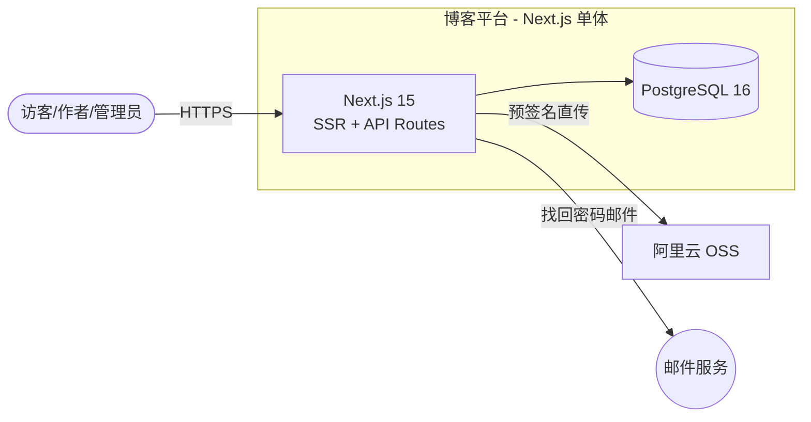

# 示例：博客平台全流程

一个"技术团队写博客"的平台的完整走查。省略了中间的提问往返，展示每个阶段**产出长什么样**。四个文档分别对应 assets/templates/ 下的四个模板。

> 场景：3 人团队（2 全栈 1 兼职前端），技术栈熟 TypeScript + Python，想做一个团队对外的技术博客站，兼顾站内同事发文章。

---

## Phase 1 产出 → docs/architecture/requirements.md（节选）

**项目概述**：为团队提供对外技术博客（品牌/招聘门面），同时作为内部知识沉淀库。成功标准：上线 3 个月积累 30 篇文章、日均独立访客 500。

**角色**：匿名访客（读）、作者（团队同事，写/改自己的文章）、管理员（审核、下架、评论管理）。

**界面与体验（节选）**：页面清单——首页、文章列表、文章详情、登录、写作台、管理后台、404（见 Phase 4 页面清单表）；双端响应式（读者手机占比预期高，作者写作以桌面为主）；**SEO 是对外博客的成功标准之一**——直接支撑 ADR-0001 的 SSR 决策；组件库 shadcn/ui + Tailwind（给用户看过两个参照站点后确认）；界面状态要求——加载骨架屏、空列表引导页、404 页。

**功能需求（节选）**：

### REQ-001 访客浏览文章 [MUST]
**用户故事**：作为匿名访客，我想要浏览已发布文章列表并阅读全文，以便获取团队的技术内容。
**验收标准**：
- [ ] 当访客打开首页时，系统应按发布时间倒序分页（每页 10 篇）展示已发布文章的标题、摘要、作者、发布时间
- [ ] 当访客点击文章时，系统应在 1 秒内展示渲染后的 Markdown 全文
- [ ] 如果文章不存在或未发布，系统应返回 404 页面

### REQ-003 作者发布文章 [MUST]
**用户故事**：作为作者，我想要用 Markdown 撰写并发布文章，以便不需要排版工具。
**验收标准**：
- [ ] 当作者提交合法标题（1-100 字符）与正文时，系统应保存为草稿并返回 201
- [ ] 当作者点击发布时，系统应将草稿转为已发布状态并立即对访客可见
- [ ] 当提交空标题时，系统应返回 422 字段级错误且不落库
- [ ] 系统应保存每次保存的时间戳与作者

### REQ-005 评论 [SHOULD]
（访客登录后可评论；管理员可删除；支持一层回复——验收标准略）

### REQ-008 全文搜索 [COULD]
（对标题与正文按关键词搜索——验收标准略）

**Out of Scope（明确不做，本期）**：多语言内容、移动端 App（做响应式 Web 即可）、站内私信、数据大屏、导入旧系统数据（旧内容手工迁移约 20 篇）。

**非功能需求（节选）**：
| 编号 | 要求 | 优先级 |
|---|---|---|
| NFR-001 | 当访客打开文章页时，系统应保证 P95 加载 < 1s（缓存生效时） | MUST |
| NFR-002 | 系统应将密码以 bcrypt 哈希存储 | MUST |
| NFR-003 | 当评论中包含 HTML/script 标签时，系统应转义显示而非执行 | MUST |

**待澄清**：Q-001 微信扫码登录还是账号密码（答复：账号密码 + 邮箱找回，closed）。

---

## Phase 2 产出 → 蓝图 §2 规模估算

```
假设：DAU 800（对外 500 + 团队 300），人均 8 请求，峰值系数 3，读:写 = 30:1
推算：平均 QPS ≈ 0.07，峰值 QPS ≈ 0.22（写几乎忽略）
存储：文章 20KB/篇 × 100 篇/年 ≈ 2 MB/年；图片 500KB/张 × 1000 张/年 ≈ 0.5 GB/年 → 对象存储
带宽：忽略不计
结论：档次 L1（PaaS 或单机 + 云托管 PG 即可），未来到 L2 的动作只有"加缓存"
难点标注：① Markdown 渲染 XSS 风险（对应 NFR-003，渲染必须白名单 sanitize）
         ② 图片直传 — 走预签名 URL 直传 OSS，不经过应用服务器
```

**注意估算如何挡住了过度设计**：有人提议"上 Elasticsearch 做搜索"——REQ-008 只是 COULD，量级 100 篇/年，PostgreSQL `ILIKE`/FTS 完全够，否决。

---

## Phase 3-4 产出 → 蓝图 §3-4 技术栈与架构（节选）

**技术栈**：Next.js 15（全栈一体：前端 + API Routes，理由：内容型站点 SEO 重要、团队 TS 熟、L1 不值得拆两个工程）+ PostgreSQL 16 + 阿里云 OSS + PaaS 部署。完整权衡 → ADR-0001（"为什么 Next.js 全栈而不是 Vite SPA + FastAPI"：SEO 需求压倒后端语言偏好，Python 只保留在数据处理脚本）。

**架构风格**：单体（Next.js 一体），理由：L1 档次、3 人团队。模块划分（modules 即目录）：

| 模块 | 职责 | 承载 |
|---|---|---|
| auth | 注册/登录/找回密码/会话 | REQ-010~012 |
| article | 文章 CRUD/发布/Markdown 渲染 | REQ-001~004 |
| comment | 评论与审核 | REQ-005~007 |
| search | 搜索（先 PG ILIKE，预留接口） | REQ-008 |
| admin | 审核/下架/评论管理 | REQ-009 |

**页面清单（前端设计）**——每条前端需求都有页面承载：

| 页面 | 路由 | 承载 REQ | 关键组件与数据依赖 |
|---|---|---|---|
| 首页 | / | REQ-001 | 最新文章卡片流 |
| 文章列表 | /articles | REQ-001, 008 | 分页列表、关键词搜索框 |
| 文章详情 | /articles/[slug] | REQ-001, 005 | Markdown 渲染（sanitize 白名单）、评论区、ISR 60s |
| 登录 | /login | REQ-010~012 | 表单、会话 Cookie |
| 写作台 | /write | REQ-003 | Markdown 编辑器、草稿保存 |
| 管理后台 | /admin | REQ-005~007, 009 | 审核队列、评论管理表格 |
| 404 | 全局 | REQ-001 | 未发布/不存在文章复用此页 |

L2 Container 图：



---

## Phase 5 产出 → 蓝图 §5-6 数据与 API（节选）

**ER（核心）**：User 1—N Article 1—N Comment；Article 状态机：`draft → published → withdrawn`（withdrawn 可回 draft）。

**API 清单（节选）**：

| 方法+路径 | 用途 | 鉴权 | REQ |
|---|---|---|---|
| GET /api/v1/articles?page= | 分页已发布文章 | 公开 | REQ-001 |
| GET /api/v1/articles/:slug | 文章全文 | 公开（未发布仅作者可见） | REQ-001/003 |
| POST /api/v1/articles | 创建草稿 | 作者 | REQ-003 |
| POST /api/v1/articles/:id/publish | 发布 | 作者本人 | REQ-003 |
| POST /api/v1/articles/:id/comments | 评论 | 登录用户 | REQ-005 |

**权限模型（RBAC）**：role ∈ {admin, author}；作者只能改/发自己的文章（service 层按 user_id 校验）；管理员全权。

---

## Phase 6-7 产出 → 蓝图 §7 + ADR

**质量设计（节选）**：Markdown 渲染统一走 `sanitize(markdown-it)` 白名单管道（NFR-003）；文章页 ISR 缓存 60s 满足 NFR-001；失效模式——OSS 挂：文章文字仍可读，图片裂图（接受）；SMTP 挂：找回密码不可用，`/readyz` 不纳入 SMTP（避免邮件商故障导致整站重启），告警人工介入。

**ADR-0001: Next.js 全栈而非前后端分离**（状态 accepted，节选）：
- 选项：① Next.js 全栈 ② Vite SPA + FastAPI
- 决策：①。理由：SEO 是对外博客硬需求（成功标准之一），SSR 一体省一套工程；代价是后端逻辑受限于 JS/TS 生态，数据处理脚本（阅读统计）单独用 Python 跑定时任务，不进主应用。
- 后果：重逻辑集中在 API Routes，模块边界靠目录约定（见 L3 图）；若未来出现重型后端需求（如向量检索服务），以独立服务形式加，不改现有结构。

**ADR-0002: 评论用一层回复而非无限嵌套**（状态 accepted，节选）：
- 理由：无限嵌套的树查询与渲染复杂度对"SHOULD 级"需求不成比例；一层回复（评论 + 对评论的回复，数据模型上就是 parent_id 一列且深度 ≤ 1）覆盖 95% 讨论场景。
- 后果：`comments.parent_id` 允许 NULL，应用层校验"回复的回复"非法；未来要放开需迁移数据（已记录触发条件）。

**ADR-0003: 搜索先用 PostgreSQL ILIKE，过万再上搜索组件**（状态 accepted，节选）：
- 选项：① PG ILIKE ② 现在就引入 Meilisearch
- 决策：①。理由：REQ-008 是 COULD 级，100 篇/年量级 ILIKE 毫秒返回；为 COULD 需求新增一套常驻组件违反 YAGNI。
- 后果：search 模块 service 层签名不依赖 PG 方言（可替换）；触发条件——文章总量 > 1 万或搜索 P95 > 500ms 时重新选型，届时 supersede 本篇。

---

## Phase 9 产出 → docs/architecture/plan.md（节选）

| 里程碑 | 内容 | 可演示物 | 状态 |
|---|---|---|---|
| M0 | 骨架 + CI + 部署流水线 | 空应用线上可访问 | ☐ |
| M1 | auth（REQ-010~012） | 能注册登录、能找回密码 | ☐ |
| M2 | article（REQ-001~004） | 能写、能发、访客能看 | ☐ |
| M3 | comment + admin（REQ-005~009） | 评论与审核闭环 | ☐ |

任务卡示例：

```markdown
### T-07 文章发布与状态机  [状态: ☐ / in-progress / done(日期)] ｜ [评审: ☐ / issues / passed(日期)]
- 实现: REQ-003, REQ-004
- 依赖: T-05（articles 表迁移）, T-03（鉴权中间件）
- 产出: modules/article/{routes,service,repo,schema}.ts, migrations/0005_articles.sql
- 验收标准:
  - [ ] 当作者提交合法标题与正文时，系统应保存为草稿并返回 201
  - [ ] 当提交空标题时，系统应返回 422 且不落库
  - [ ] 如果用户不是该文章作者，系统应对 publish 返回 403
  - [ ] 当文章从 published 改回 withdrawn 时，系统应对访客返回 404
- DoD: 测试 + lint + typecheck + 冒烟 + 评审通过 + 蓝图 API 清单同步
```

---

## Phase 10 执行 → 任务卡流转（节选）

标准/完整档每个任务走"实现者 → 评审者 → 通过才收账"双代理循环。以 T-07 为例：

| 轮次 | 实现者子代理 | 评审者子代理（零上下文） | 结果 |
|---|---|---|---|
| 1 | 完成代码 + 测试 + 质量门禁，交账 | 验收标准第 3 条（非作者 publish 应 403）没有对应实现与测试——**阻塞**；`service.ts` 静默吞掉状态机非法流转异常——建议 | issues |
| 2 | 补授权检查点与测试，异常改为显式报错 | 复审只看修复项：阻塞清除，建议已处理 | passed → 勾掉 T-07 |

评审者只出报告不改码，阻塞回实现者最多 2 轮；2 轮后仍有阻塞按 B 类停下改蓝图。

---

## Phase 11 验收（节选）

| REQ | 实现位置 | 验证证据 | 结果 |
|---|---|---|---|
| REQ-001 | modules/article/repo.ts | 集成测试 `list_published_paginated`；手工：无痕窗口浏览 | ✅ |
| REQ-003 | modules/article/service.ts | 集成测试 `publish_flow`；空标题 422 用例 | ✅ |
| REQ-005 | modules/comment/service.ts | 集成测试 `login_required_comment` | ✅ |
| REQ-008 | modules/search/service.ts | 手工（COULD 级）：关键词搜索返回预期 | ✅ |

交付说明：运行方式见 README；已知限制——搜索为 PG ILIKE（数据过万后重审，见 ADR-0003 触发条件）；后续建议——评论邮件通知（原 SHOULD 因 SMTP 配置问题移期）。

---

## 这个示例想说明的三件事

1. **估算真的挡住了过度设计**：搜索用 ILIKE、单体不拆、评论一层回复——每个"降级"都有依据，不是偷懒。
2. **编号串起一切**：REQ-003 → API `POST /articles` → 任务 T-07 → 测试 `publish_flow` → 验收表。哪一环断了都能立刻发现。
3. **四份文档各司其职**：requirements 管"要什么"，blueprint 管"怎么建"，decisions 管"为什么这么建"，plan 管"何时建完"。
