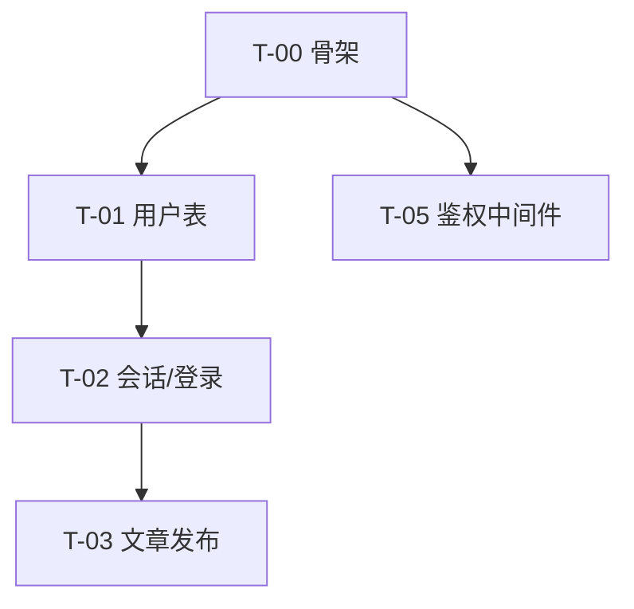

# 实施计划：<项目名>

> 版本：v0.1 ｜ 日期：YYYY-MM-DD ｜ 状态：draft → in-progress → done
> 用法：任务完成就勾选并填"完成日"。设计与实现冲突时先改蓝图/补 ADR，再改本文件，最后写码。

## 1. 里程碑

规则：**每个里程碑结束时项目必须能运行、能演示**（哪怕功能很少）；里程碑即向用户演示与收集反馈的节点。

| 里程碑 | 内容 | 可演示物 | 目标日期 | 状态 |
|---|---|---|---|---|
| M0 骨架 | 目录结构、CI、docker-compose、README | `npm run dev` 能起、CI 绿 | <日期> | ☐ |
| M1 认证与用户 | REQ-010~012 | 能注册登录改资料 | <日期> | ☐ |
| M2 核心功能 | REQ-001~005 | 文章能发能看 | <日期> | ☐ |

## 2. 任务清单

> 任务粒度 0.5-2 天，超过就再拆。依赖必须成 DAG（无环）。每个任务必须标注实现的 REQ——**没有 REQ 的任务要么是漏需求（回 requirements.md 补编号），要么是不该做**。

### 任务卡格式

```markdown
### T-01 <任务标题>  [状态: ☐ / in-progress / done(日期)]

- 实现: REQ-001, REQ-002
- 依赖: T-00（骨架）
- 产出: <文件/接口/迁移>
- 验收标准:
  - [ ] <直接引用或细化 REQ 的 EARS 条目>
  - [ ] 对应集成测试通过
- DoD: 质量门禁四件套（测试/全量通过/lint+类型/冒烟）+ 文档同步
```

### 示例

```markdown
### T-03 文章发布与校验

- 实现: REQ-003（作者创建文章）, REQ-004（标题必填）
- 依赖: T-02（文章表迁移）, T-05（鉴权中间件）
- 产出: modules/article/{routes,service,repo,schema}.ts + migrations/0003_articles.sql
- 验收标准:
  - [ ] 当作者提交合法标题与正文时，系统应创建文章并返回 201 与新文章 ID
  - [ ] 当提交空标题时，系统应返回 422 与字段级错误提示，且不落库
  - [ ] 如果用户未登录，系统应对 POST /articles 返回 401
- DoD: lint + typecheck + 全量测试 + 冒烟通过；蓝图 §6 API 清单同步
```

## 3. 依赖图与波次

互不依赖的任务分组成**波次**：波次间串行、波次内可并行（多会话/子代理各领一个任务）。



## 4. 开发执行约定（Phase 10 用）

1. 严格按依赖顺序执行；无依赖关系的任务可并行。
2. 每完成一个任务：勾选 + 填完成日 + 质量门禁通过。
3. 发现新需求 → 先按 Phase 1 格式进 requirements.md 拿到编号 → 再决定排进哪个里程碑。
4. 每个里程碑结束 → 向用户演示 → 收集反馈 → 必要时调整后续任务与蓝图。

## 5. 验收记录（Phase 11 填写）

对照 requirements.md 逐条：

| REQ | 优先级 | 实现位置 | 验证证据 | 结果 |
|---|---|---|---|---|
| REQ-001 | MUST | modules/article/service.ts | 集成测试 `list_articles` + 手工步骤 | ✅/❌ |

MUST 全部 ✅ 方可交付。未完成的 SHOULD/COULD → "后续迭代建议"。
