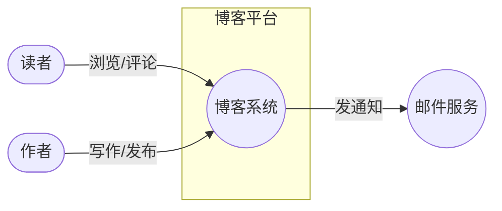
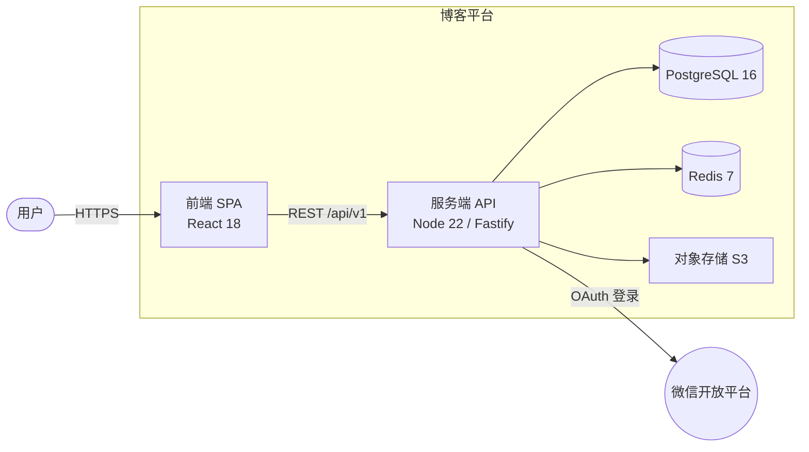
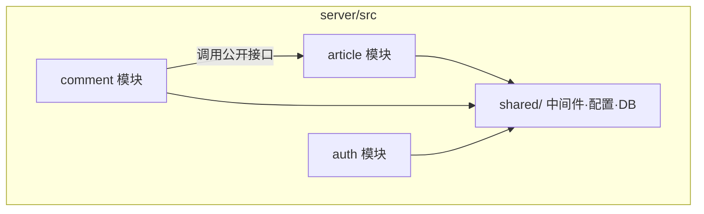
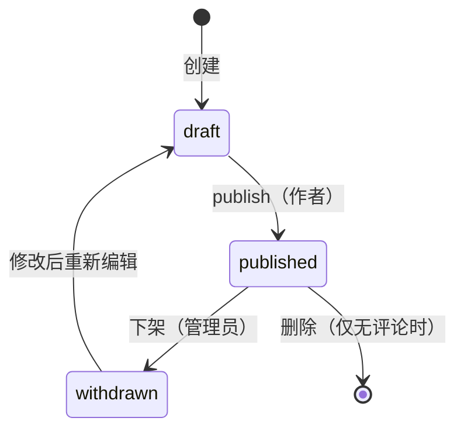
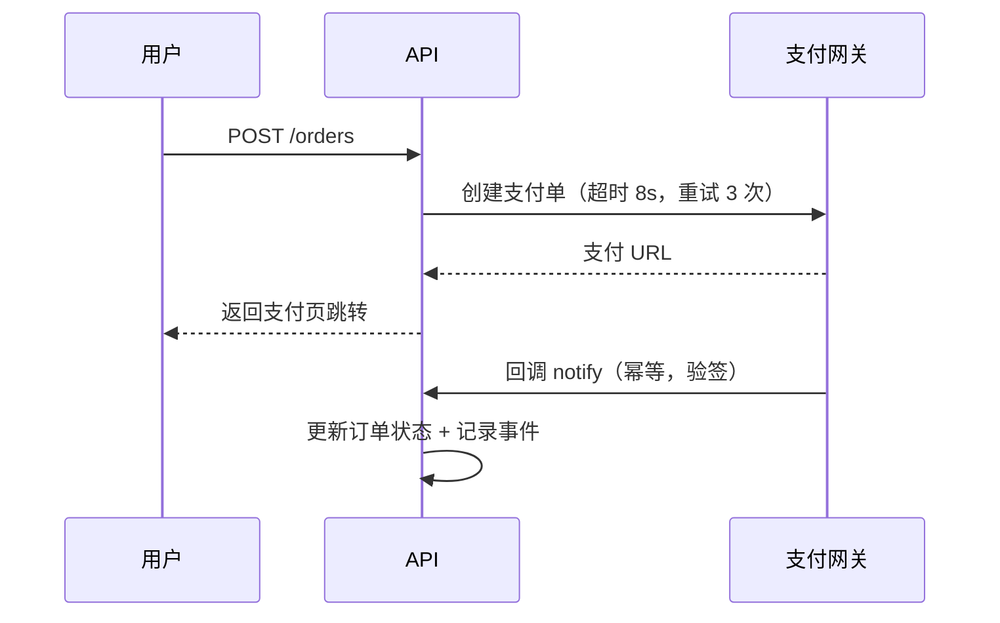
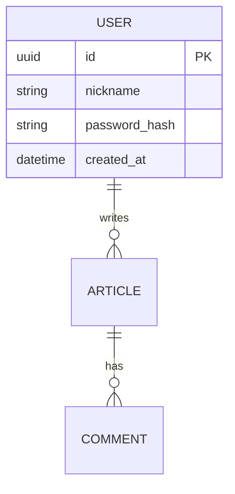

# C4 模型与 Mermaid 图表

## 一、画图的总原则

- **图是给人看 + 给未来改的**：优先能进 git、能用文本 diff 的 Mermaid，不用需要专门软件的图（drawio 导出 PNG 进仓库，改一次丢一次源）。
- **每张图只回答一个问题**，别把所有信息塞一张图里。
- 图随代码漂移就作废——蓝图评审（Phase 8）和里程碑演示时顺带核对图与实现是否一致。

## 二、C4 三级（够用即可，全画四级的场景很少）

| 级别 | 回答的问题 | 里面有什么 | 谁看 |
|---|---|---|---|
| L1 System Context | 系统和谁打交道？ | 本系统（一个盒子）+ 用户角色 + 外部系统 | 所有人，蓝图第一张图 |
| L2 Container | 系统由哪些可部署单元组成？ | SPA / 服务端 / 数据库 / 缓存 / 对象存储 / 第三方 | 技术相关人，**架构设计的核心图** |
| L3 Component | 单个部署单元内部怎么分模块？ | modules 里的模块及其依赖 | 开发者 |

规则：
- L1 必画，L2 必画，L3 在模块 ≥ 4 个或依赖关系复杂时画。
- 外部系统和用户角色必须与需求文档一致（"用户与角色"与"集成"两个维度的产物）。
- 每个盒子标注技术选型（"PostgreSQL 16"而不是"数据库"）。

## 三、Mermaid 语法模板

### L1 System Context

### L2 Container

### L3 Component（服务端内部）

注意：L3 图里依赖箭头应与 patterns.md 的"依赖方向单一"一致，出现环即设计问题。

### 其他常用图

- **状态机**（有状态流转的实体必画）：

- **关键流程时序图**（写操作 + 第三方交互必画，如下单支付）：

- **ER 图**（Phase 5 数据建模）：

## 四、产图检查清单

- [ ] L1/L2 两张图存在且盒子都标注了具体技术
- [ ] 图里的组件与蓝图"技术栈/模块划分"章节一一对应，没有幽灵组件
- [ ] 每张图有标题和一句话说明它回答什么问题
- [ ] 有状态实体的状态机已画
- [ ] 核心写流程（支付/发布等）有时序图，第三方交互标了超时重试
